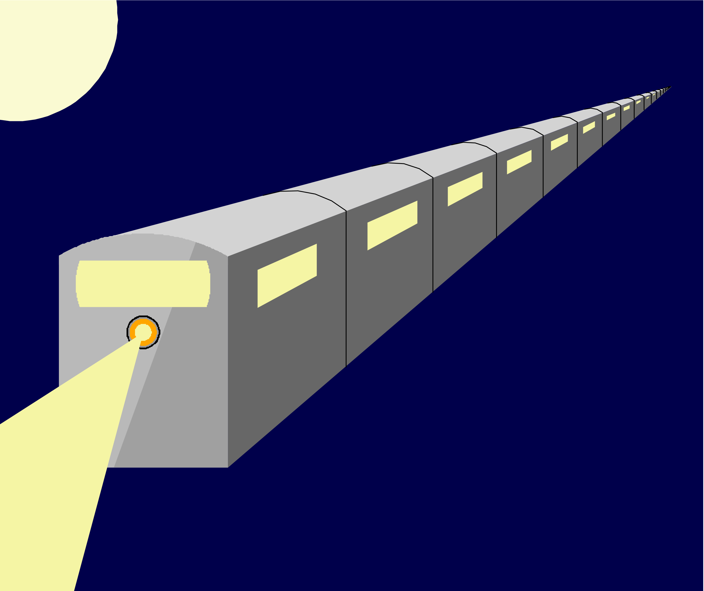

# Night Train Recursive Art



This repository contains a recursive drawing I designed and created using a scheme interpreter that I built. My original scheme interpreter can be found here: 
 https://github.com/MilesGreen7/Scheme-Interpreter

## How to See Drawing in Made in Realtime

Run the following command in your terminal to see the program draw the night train in realtime

```
python scheme.py contest.scm --turtle-save-path output
```

## Troubleshooting:

If the above command doesn't work, try this one

```
python scheme contest.scm --pillow-turtle --turtle-save-path output
```

If the previous command didn't work, you might need to install the abstract-turtle package on your system. Run the following snippet in your terminal

```
pip install abstract-turtle
```
